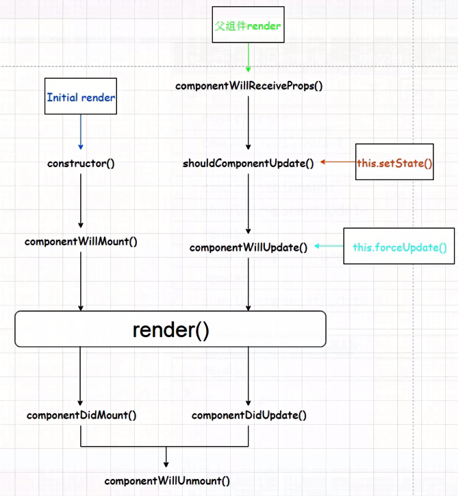
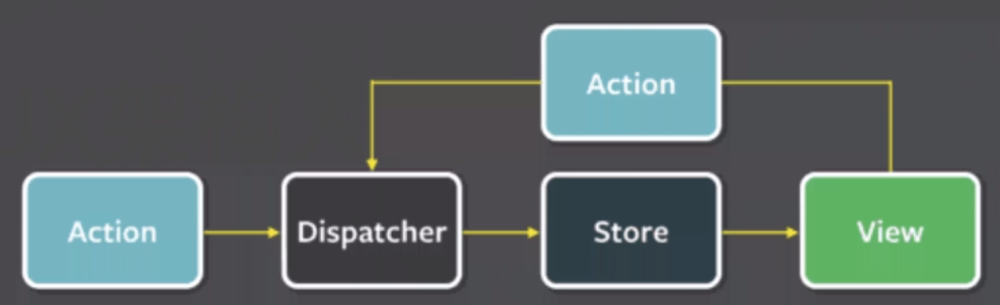

# tips
> state 内放置与 页面展示 相关的数据
## 组件の声明
+ ES5（已废弃） --- React.createClass
+ ES6 --- class TodoList extends React.Component
# React 生命周期
* 
* shouldComponentUpdate
>
```
//提升性能 （是否更新）
shouldComponentUpdate(nextProps,nextState) {
  if (nextState.name != this.state.name){
    return true
  }else {
    return false
  }
}
```

1.实例化
> getDefaultProps       取得默认属性
> getInitialState       初始化状态
> componentWillMount    即将进入dom
> render                绘画dom
> componentDidMount     已经进入dom
2.存在期（参照数据更新过程）
3.销毁时 componentWillUnmount


# Flux架构入门
* 流程
1.用户访问View
2.View 翻出用户的 Action
3.Dispatcher 收到 Action，要求Store进行相应的更新
4.Store更新后，发出一个“change”事件
5.View收到“change”事件后，更新页面

